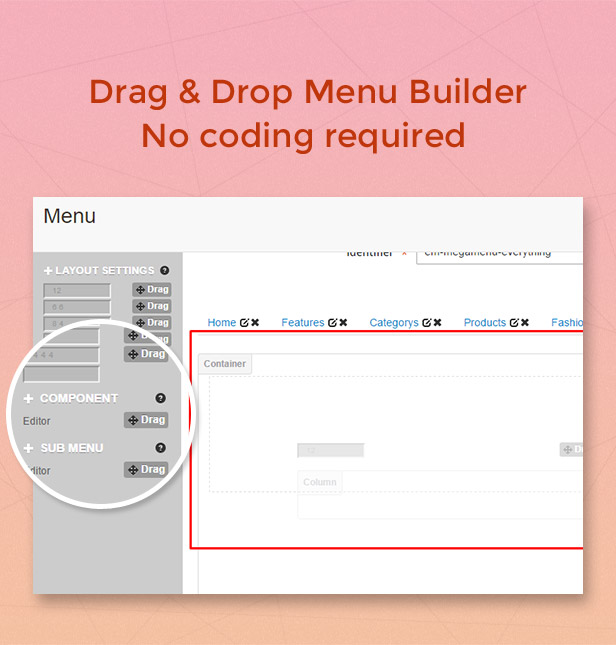
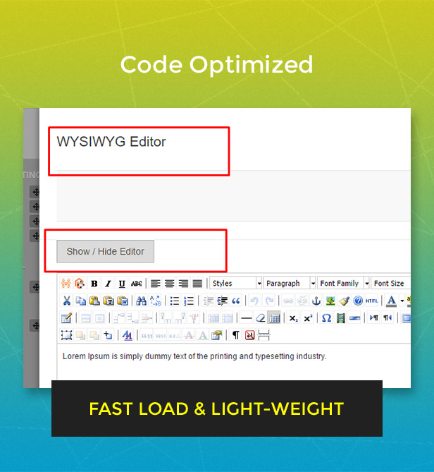
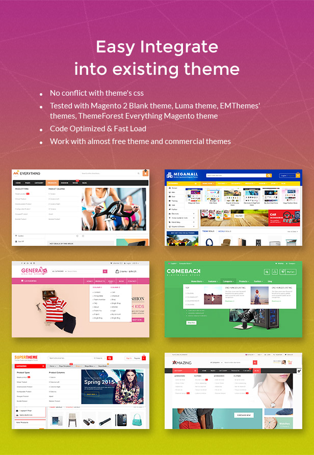
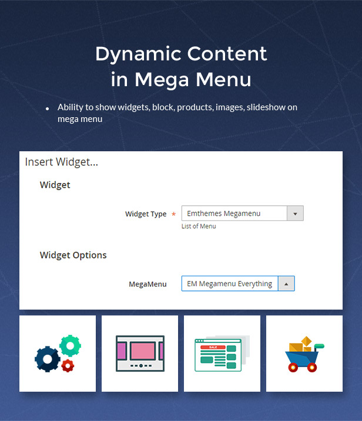
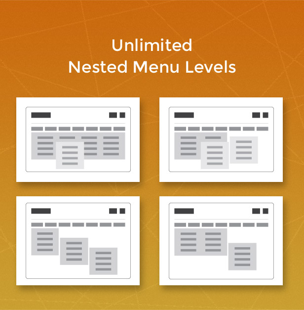
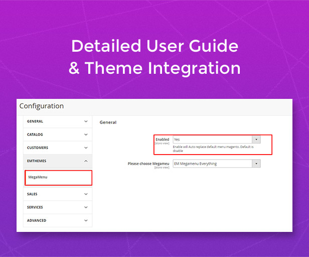

<h2>EM MegaMenu - Magento 2 Mega Menu Extension</h2>

<strong>EM MegaMenu</strong> is a <strong>Magento 2 Extension</strong> let you build mega menu for your online store without coding skill required. With drag &amp; drop UI/UX, you can build your own mega menu professionally. The Mega Menu Magento 2 extension is developed by Magento certified developer, ultimately provide rich features, fast load, code optimised, SEO expert, mobile friendly. This extension is perfect for you store.

<h2>Features</h2>

<ul>
	<li>Mega menu supports unlimited layouts, grids, columns.</li>
	<li>Be trusted and used in the bestselling Magento themes: EM Everything, Comeback, Amazing, Supermarket, SuperTheme...</li>
Magento themes use this Mega Menu extension:
	<li>Drag &amp; Drop Menu Builder, creating menu never easier, no coding required.</li>
	<li>Code Optimised, fast loading and light-weight on desktop and mobile.</li>
	<li>Easy Integrate into existing theme:
		<ul>
			<li>No conflict with theme's css.</li>
			<li>Tested with Magento 2 Blank theme, Luma theme, EMThemes' themes, ThemeForest Everything Magento theme.</li>
			<li>Work with almost free theme and commercial themes.</li>
		</ul>
	</li>
	<li>Dynamic content in Mega Menu:
		<ul>
			<li>Ability to show widgets, block, products, images, slideshow on mega menu</li>
			<li>Icons hoạ widget, block, product item, sldieshow, banner</li>
		</ul>
	</li>
	<li>Unlimited Nested Menu Levels.</li>
	<li>Detailed User guide &amp; Theme integration.</li>
	<li>24/7 Best Customer Support from Magento Certified Developers</li>
</ul>